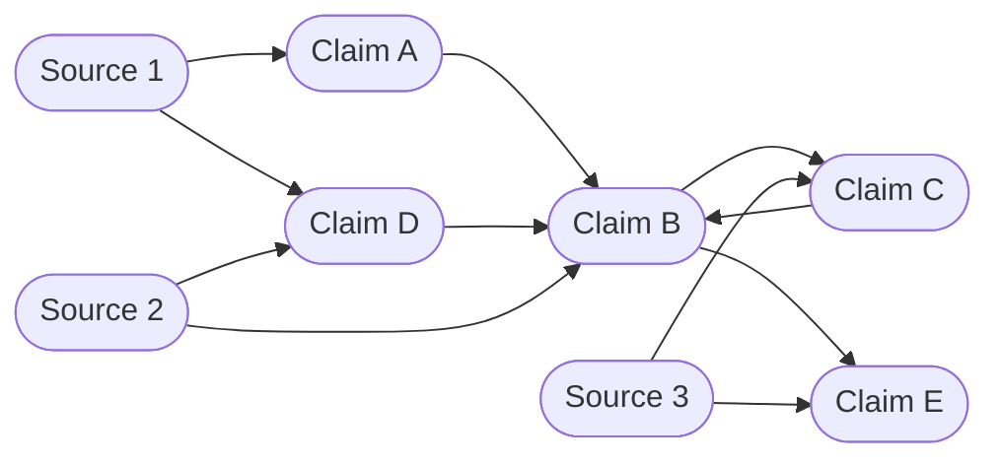

# Shelley

## Introduction

This is a **free, open-source, non-commercial public service**, operating as a website. Its aim is to faithfully represent every possible argument for and against any topic which can be discussed rationally. So that one can get an in-depth overview of the many facettes of any topic.

> Think Wikipedia, but for discussions.

Arguments are **proposed and rated by the community**. Because they themselves have to either reference an argument, or cite a source, a tree of nodes is created with every argument being made. Every node is a dot in the tree of knowledge. It can be referenced anywhere where applicable and **critiqued by anyone**.

These are the most fundamental rules for the platform:

* Arguments are crowd-sourced by the community.
* Every argument must either reference another argument or an external source.
* Arguments are evaluated by a transparent formula.
* Critiques trigger recursive adjustments to dependent arguments.
* Sources must be publicly available.

## Philosophy

* **Accuracy**: The platform must encourage the users psychologically and technically to make the most objective arguments possible and to cite relevant sources.
* **Accessibility**: There shall never be any kind of paywall. Anyone with the priviledge to access the internet should have access to all content created on this platform. On our side it means to design a system which is compliant to the *WC3 Acessibility Standards*, enable features so non-English speakers can participate in the key parts of this platform (technical development, conceptual development, usage of the platform and content moderation), and most importantly: never hide content to non-payers.
* **Transparency**: Every decision made for the platform on a meta-level or in the context of the content being created, altered or deleted must be tracable back to *"Why was this change made?"*, *"When was it made?"*, *"Who made it?" and "Who approved it?".*
* **Independence**: This platform must be independent of any centrally organized body of decision-makers. E.g.: companies or governments. Donations must be handled anonymously and will give nobody the right to alter the platform with more power than anyone else has, or see any more than anybody else can.

## Contribution

> The project is currently in the planning mode. Technical development will be kick-started once the concept is ready.

Say, you have an idea on how to improve the way this platform works. Great! Let me walk you through the steps. It's really not hard, I promise!

1. Locate the file you would like to change in the file browser above, click on it
2. Click the pen-button in the upper right corner
3. Click the fork button
4. Make the changes you want
5. Click 'Commit changes...'
6. Briefly summarize your changes
7. Click 'Create pull request'

You are done! Now you can sit back and enjoy a nice cup of a hot beverage you like. Your changes will be reviewed and if there are any questions or feedback from the reviewers, you will be notified.

Thank you for your help, you are the best <3.
