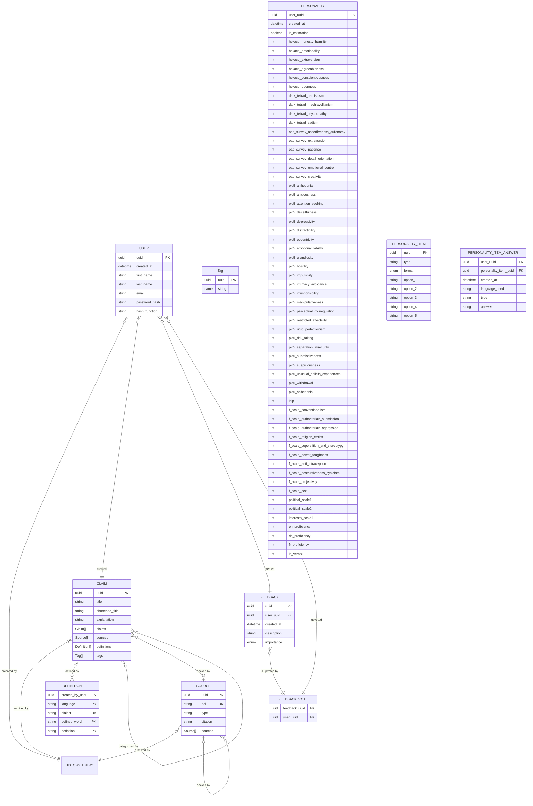

# Data Structure

```mermaid
erDiagram
    USER {
        uuid uuid PK
        datetime created_at
        string first_name
        string last_name
        string email
        string password_hash
        string hash_function
    }

    CLAIM {
        uuid uuid PK
        string title
        string shortened_title
        string explanation
        Claim[] claims
        Source[] sources
        Definition[] definitions
        Tag[] tags
    }

    SOURCE {
        uuid uuid PK
        string doi UK
        string type
        string citation
        Source[] sources
    }

    DEFINITION {
        uuid created_by_user FK
        string language PK
        string dialect UK
        string defined_word PK
        string definition PK
    }

    HISTORY_ENTRY {}

    FEEDBACK {
        uuid uuid PK
        uuid user_uuid FK
        datetime created_at
        string description
        enum importance
    }

    FEEDBACK_VOTE {
        uuid feedback_uuid PK
        uuid user_uuid PK
    }

    Tag {
        uuid uuid PK
        name string
    }

    PERSONALITY {
        uuid user_uuid FK
        datetime created_at
        boolean is_estimation
        
        int hexaco_honesty_humility
        int hexaco_emotionality
        int hexaco_extraversion
        int hexaco_agreeableness
        int hexaco_conscientiousness
        int hexaco_openness

        int dark_tetrad_narcissism
        int dark_tetrad_machiavellianism
        int dark_tetrad_psychopathy
        int dark_tetrad_sadism

        int oad_survey_assertiveness_autonomy
        int oad_survey_extraversion
        int oad_survey_patience
        int oad_survey_detail_orientation
        int oad_survey_emotional_control
        int oad_survey_creativity

        int pid5_anhedonia
        int pid5_anxiousness
        int pid5_attention_seeking
        int pid5_deceitfulness
        int pid5_depressivity
        int pid5_distractibility
        int pid5_eccentricity
        int pid5_emotional_lability
        int pid5_grandiosity
        int pid5_hostility
        int pid5_impulsivity
        int pid5_intimacy_avoidance
        int pid5_irresponsibility
        int pid5_manipulativeness
        int pid5_perceptual_dysregulation
        int pid5_restricted_affectivity
        int pid5_rigid_perfectionism
        int pid5_risk_taking
        int pid5_separation_insecurity
        int pid5_submissiveness
        int pid5_suspiciousness
        int pid5_unusual_beliefs_experiences
        int pid5_withdrawal
        int pid5_anhedonia

        int ipip

        int f_scale_conventionalism
        int f_scale_authoritarian_submission
        int f_scale_authoritarian_aggression
        int f_scale_religion_ethics
        int f_scale_superstition_and_stereotypy
        int f_scale_power_toughness
        int f_scale_anti_intraception
        int f_scale_destructiveness_cynicism
        int f_scale_projectivity
        int f_scale_sex

        int political_scale1

        int political_scale2

        int interests_scale1

        int en_proficiency
        int de_proficiency
        int fr_proficiency

        int iq_verbal
    }

    PERSONALITY_ITEM {
        uuid uuid PK
        
        string type
        enum format

        string option_1
        string option_2
        string option_3
        string option_4
        string option_5
    }

    PERSONALITY_ITEM_ANSWER {
        uuid user_uuid FK
        uuid personality_item_uuid FK
        datetime created_at

        string language_used
        string type
        string answer
    }

    USER }o--|| HISTORY_ENTRY : "archived by"
    USER }o--|| CLAIM : "created"
    
    USER }o--|| FEEDBACK : "created"
    USER }o--|| FEEDBACK_VOTE : "upvoted"
    FEEDBACK }o--|| FEEDBACK_VOTE : "is upvoted by"
    
    CLAIM }o--|| HISTORY_ENTRY : "archived by"
    SOURCE }o--|| HISTORY_ENTRY : "archived by"
    CLAIM }o--o{ DEFINITION : "defined by"
    CLAIM }o--o{ CLAIM : "referenced by"
    CLAIM }o--o{ CLAIM : "categorized by"
    CLAIM }o--o{ SOURCE : "backed by"
    SOURCE }o--o{ SOURCE : "backed by"
```
