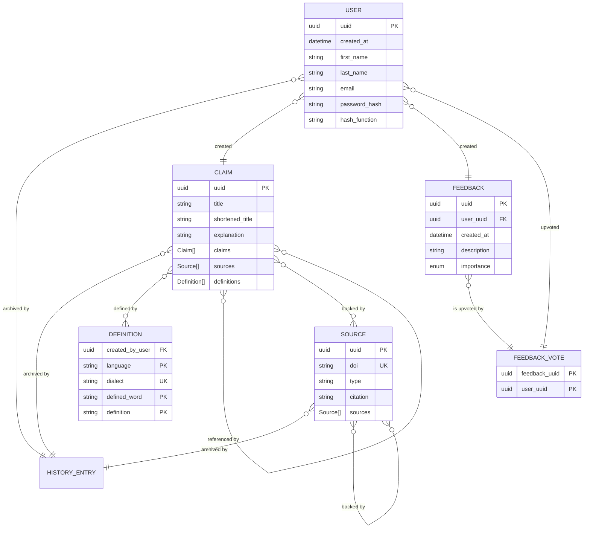

# Data Structure

```mermaid
erDiagram
    USER {
        uuid uuid PK
        datetime created_at
        string first_name
        string last_name
        string email
        string password_hash
        string hash_function
    }

    CLAIM {
        uuid uuid PK
        string title
        string shortened_title
        string explanation
        Claim[] claims
        Source[] sources
        Definition[] definitions
    }

    SOURCE {
        uuid uuid PK
        string doi UK
        string type
        string citation
        Source[] sources
    }

    DEFINITION {
        uuid created_by_user FK
        string language PK
        string dialect UK
        string defined_word PK
        string definition PK
    }

    HISTORY_ENTRY {}

    FEEDBACK {
        uuid uuid PK
        uuid user_uuid FK
        datetime created_at
        string description
        enum importance
    }

    FEEDBACK_VOTE {
        uuid feedback_uuid PK
        uuid user_uuid PK
    }

    USER }o--|| HISTORY_ENTRY : "archived by"
    USER }o--|| CLAIM : "created"
    
    USER }o--|| FEEDBACK : "created"
    USER }o--|| FEEDBACK_VOTE : "upvoted"
    FEEDBACK }o--|| FEEDBACK_VOTE : "is upvoted by"
    
    CLAIM }o--|| HISTORY_ENTRY : "archived by"
    SOURCE }o--|| HISTORY_ENTRY : "archived by"
    CLAIM }o--o{ DEFINITION : "defined by"
    CLAIM }o--o{ CLAIM : "referenced by"
    CLAIM }o--o{ SOURCE : "backed by"
    SOURCE }o--o{ SOURCE : "backed by"
```
