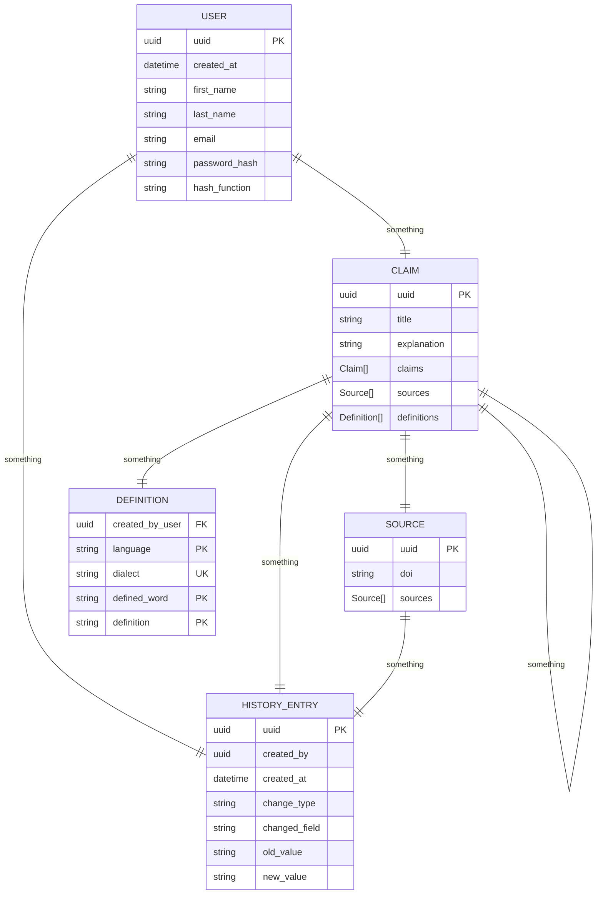

# Data Structure

```mermaid
erDiagram
    USER {
        uuid uuid PK
        datetime created_at

        string first_name
        string last_name
        
        string email
        string password_hash
        string hash_function
    }

    CLAIM {
        uuid uuid PK

        string title
        string explanation

        Claim[] claims
        Source[] sources
        Definition[] definitions
    }

    SOURCE {
        uuid uuid PK
        string doi
        Source[] sources
    }

    DEFINITION {
        uuid created_by_user FK

        string language PK
        string dialect UK
        string defined_word PK
        string definition PK
    }

    HISTORY_ENTRY {
        uuid uuid PK
        uuid created_by
        datetime created_at

        string change_type
        string changed_field
        string old_value
        string new_value
    }

    USER ||--|| HISTORY_ENTRY : something
    CLAIM ||--|| HISTORY_ENTRY : something
    SOURCE ||--|| HISTORY_ENTRY : something

    CLAIM ||--|| DEFINITION : something

    CLAIM ||--|| CLAIM : something
    CLAIM ||--|| SOURCE : something

    USER ||--|| CLAIM : something
```
